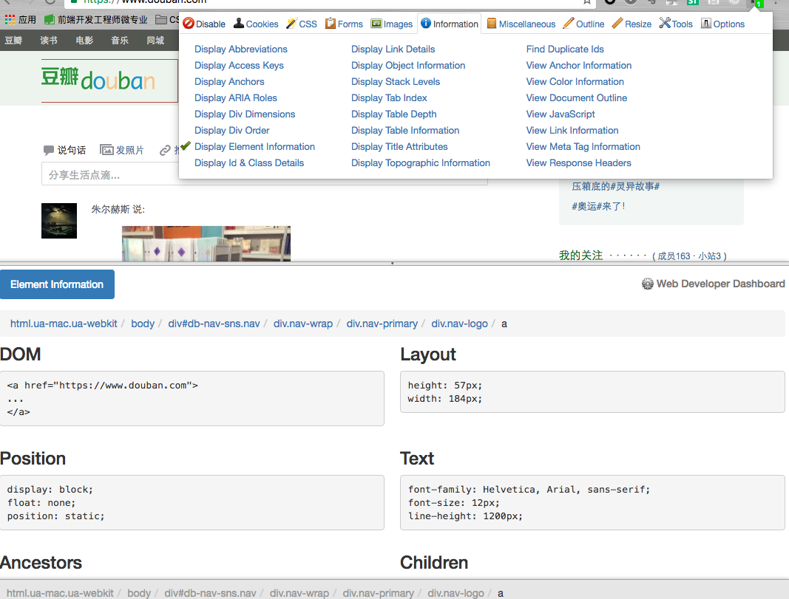

# HTML&CSS学习开发工具推荐
### Web开发工具条
网址： <http://chrispederick.com/work/web-developer/>
  
介绍：浏览器扩展，可以显示出应用到该元素的css样式以及相应的html结构。  
####1.轮廓线
显示元素占用的空间

####2.结构 
显示html结构  
  
####3.CSS样式
有助于检查在某个元素上用了哪些样式
####4.其他
该工具还允许更改屏幕大小等等，一直在继续更新中，即使关注工具条网站即可。
