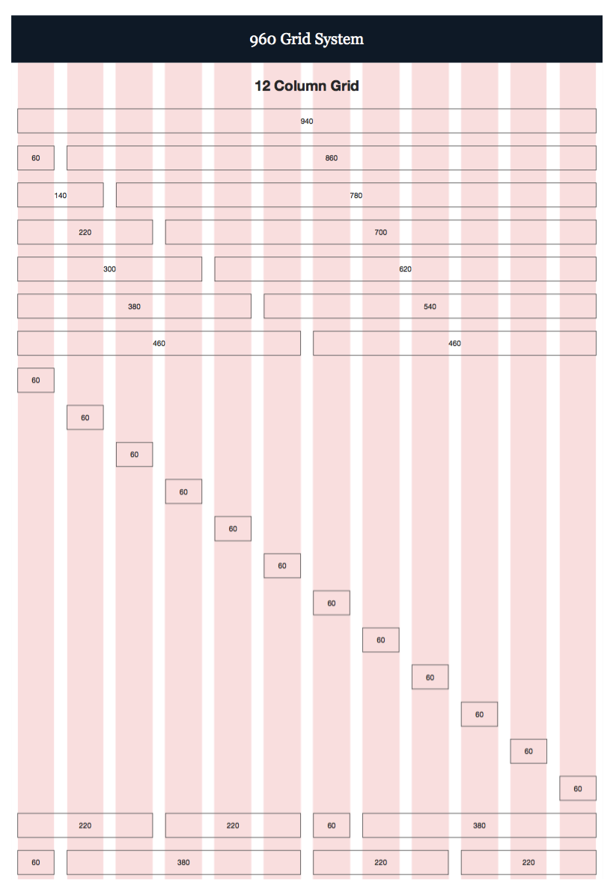

# CSS框架
####CSS框架的最常见应用就是为布局页面创建网格，今天学到的框架是960网格框架  
下载网址：<http://960.gs/>  
####网站还提供了模版下载，采用的是如下图所示的12列网格，还有一种16列的网格。

  
####创建12列的网格时，需要为包含整个页面的元素增加一个class特性，其值为container_12。这样就可以将页面内容宽度设置为960像素，并表明我们使用的网格是一个12列的网格。  
####页面上的区块可以占据网格中的1、2、3、4直到12个列，使用的类名有grid_3,grid_4等，一直到grid_12。这些列都向左浮动，并且每个列左右两侧各有10像素的外边距。    
    
#### 网上还有一些基于网格的css框架(补充学习中):

<http://blueprintcsss.org>  

<http://lessframework.com>  

<http://developer.yahoo.com/yui/grids/>